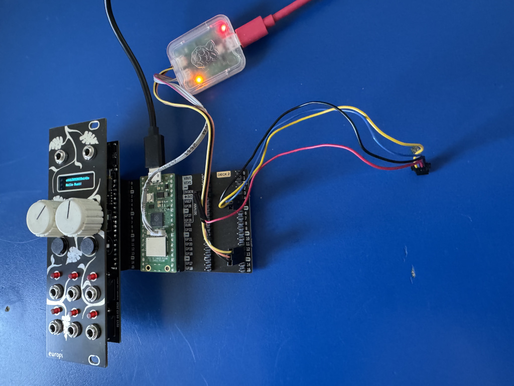

# Rust framework for the EuroPI module

See here: [EuroPi](https://github.com/Allen-Synthesis/EuroPi/tree/main). It's currently a work in progress with the idea of providing a similar API but for algorithms  written in Rust. Since the EuroPi includes an I2C interface it might make sense to use it for periperals - not yet determined which ones.

## Prerequisites (assuming a Debian or Ubuntu Linux host environment)

```shell
apt install automake autoconf build-essential texinfo libtool libftdi-dev libusb-1.0-0-dev libudev-dev openocd

rustup target install thumbv6m-none-eabi

curl --proto '=https' --tlsv1.2 -LsSf https://github.com/probe-rs/probe-rs/releases/latest/download/probe-rs-tools-installer.sh | sh
cargo install elf2uf2-rs
```

## Running from the host

A [Raspberry Pi Debug Probe](https://www.raspberrypi.com/documentation/microcontrollers/debug-probe.html) is required. Additionally it's best to use a [Pico Omnibus](https://shop.pimoroni.com/products/pico-omnibus?variant=32369533321299) to have access to all the pins, specifically the UART0 pins. Because the UART0 pins (board pin 1 and 2) are occupied by the OLED i2c0 bus the alternate pins (board pin 16 and 17) have to be used. Like this it's also easier to connect the i2c1 bus for peripherals. This setup is working and is recommended for prototyping / testing:



Once the hardware setup is completed and everything is connected all you need to do is

```shell
cargo run
```

If you want to use `embedded-tls`, you have to run it with the `--release` flag:

```shell
cargo run --release
```

The `--release` flag is currently necessary because the compilation gets stuck while processing one of the crates related to `embedded-tls`. The root cause is unknown at this point in time. 

The code is tested and runs but it does not do much except for showing the board id and the values of the analog input, knobs, and buttons. The digital input is also scanned for triggers with a very simple PIO program and an info message is shown when the interrupt is raised. If things go according to plan (which they never but even so) more functionality will be added in the forseeable future.

## Installing for productive use

Once the code is ready to be run in production compile the release version and install the u2f binary:

```shell
cargo build --release --target=thumbv6m-none-eabi
elf2uf2-rs ./target/thumbv6m-none-eabi/release/phr-eurpi
cp ./target/thumbv6m-none-eabi/release/phr-eurpi.uf2 /media/$USERNAME/RPI-RP2
```
